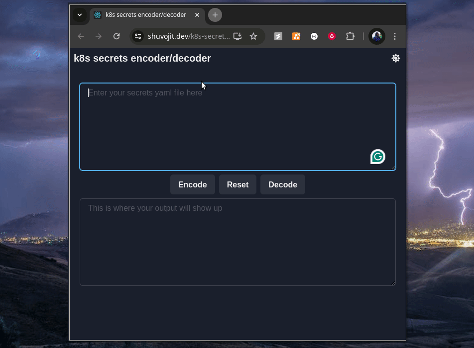

Kubernetes Secret YAML Encoder/Decoder
--------------------------------------

This web application allows you to easily encode and decode the data section of Kubernetes secrets YAML files. It's built with React and provides a user-friendly interface to manage your secrets securely.

### Features

*   Encode plain text data keys and values into base64 for safe storage in Kubernetes secrets.
    
*   Decode base64 encoded data back to plain text for viewing or editing.
    
*   Supports both stringData and data sections within the YAML file. \[To be implemented\]
    

### Usage

The application provides a simple interface with two sections:

*   **Encode:** Paste your plain text Kubernetes secrets YAML file into the top section. The application will automatically encode the data keys and values into base64 format.
    
*   **Decode:** Paste your base64 encoded Kubernetes secrets YAML file into the bottom section. The application will decode the data back to plain text.
    

### Contributing

We welcome contributions to this project! Feel free to fork the repository, make changes, and submit a pull request.
